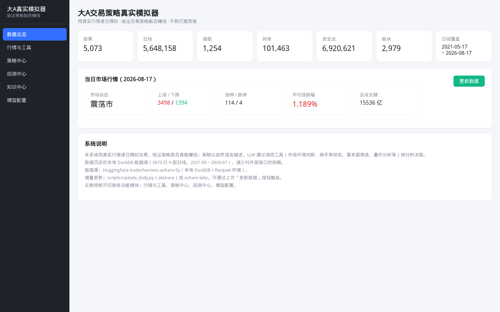
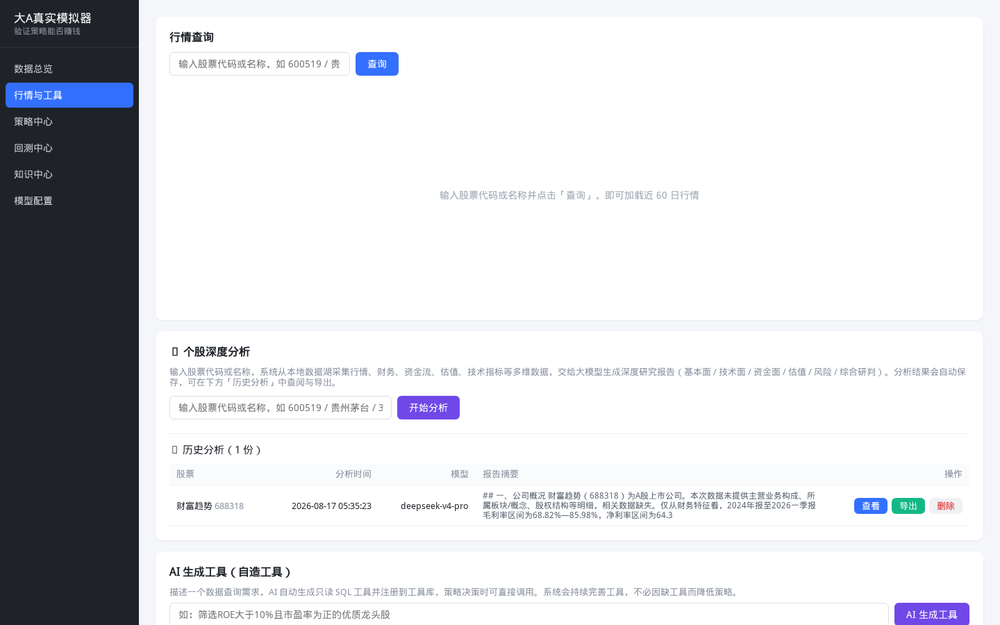
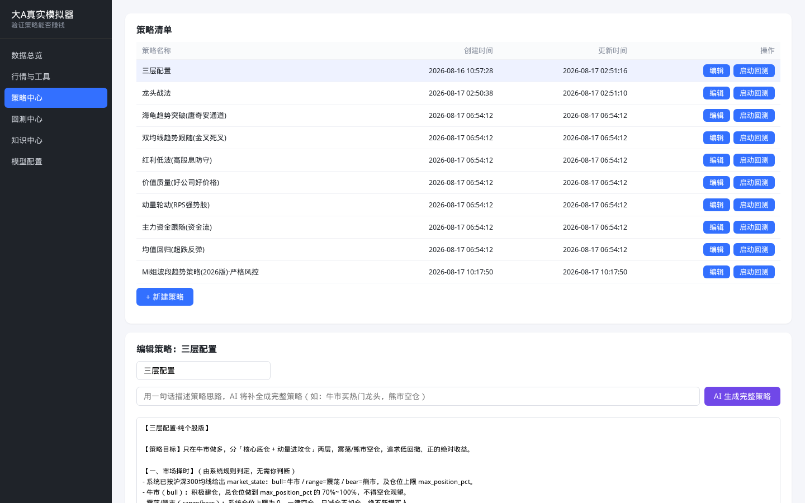
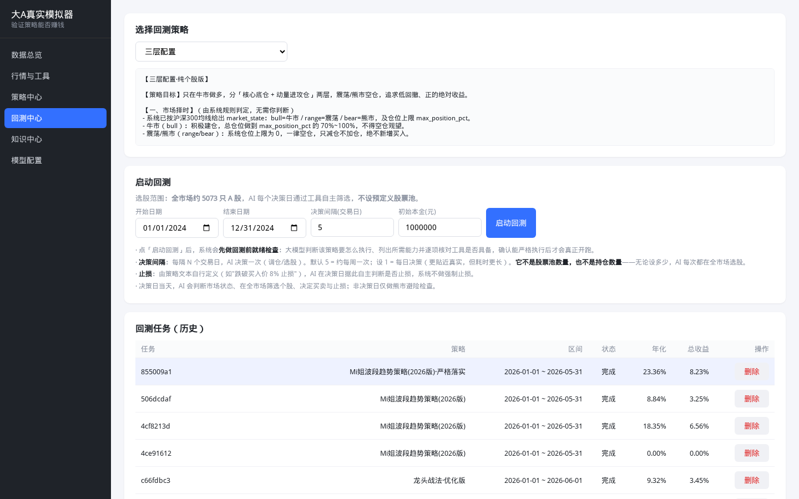
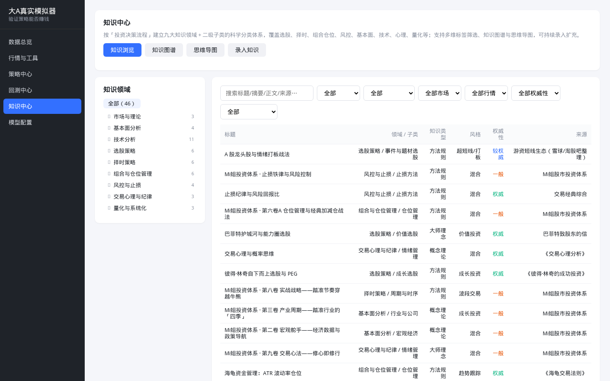
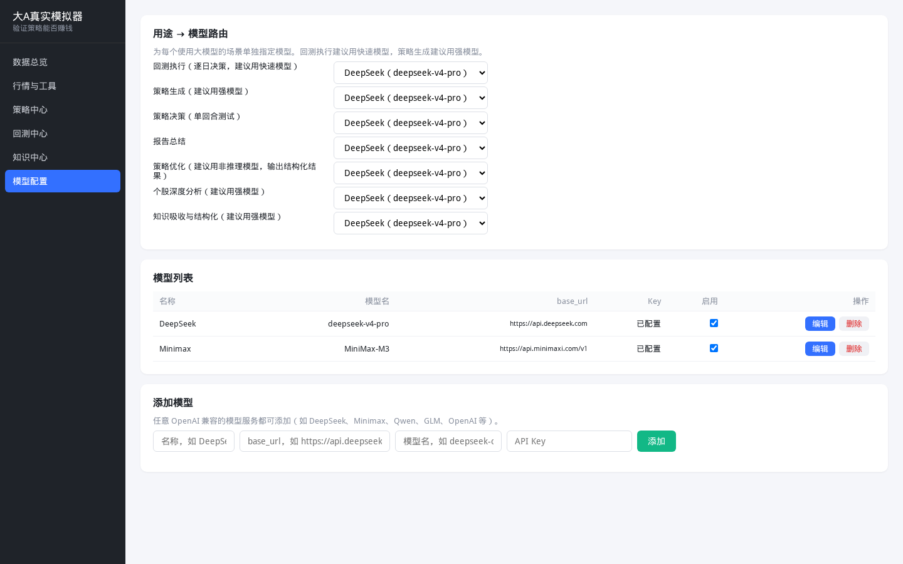

# 系统操作说明

> 本文档介绍「大A交易策略真实模拟器」的界面与操作流程。启动服务后访问 **http://127.0.0.1:8082**。

## 界面总览

左侧导航栏包含 6 个功能模块：

| 模块 | 作用 |
|---|---|
| 数据总览 | 数据湖概况、当日市场行情、数据更新 |
| 行情与工具 | 个股行情查询、LLM 深度分析、内置/自造工具 |
| 策略中心 | 策略的创建、编辑、AI 生成、管理 |
| 回测中心 | 启动回测、任务管理、绩效看板、报告与优化 |
| 知识中心 | 交易知识库（图谱/思维导图/录入/吸收） |
| 模型配置 | 大模型（OpenAI 兼容）的添加与用途路由 |

首次运行时，若未配置任何大模型，系统会**自动弹出配置弹窗**，选择预设（DeepSeek / MiniMax / OpenAI / 通义千问 / 智谱 GLM / Ollama 本地 / 自定义）并填写 API Key 即可。

## 1. 数据总览

- **数据卡片**：股票、日线、指数、财务、资金流、板块的行数，以及日线数据覆盖区间。
- **当日市场行情**：上涨/下跌家数、涨停/跌停、平均涨跌幅、总成交额、市场状态（牛/熊/震荡）。
- **更新数据**：手动触发一次在线增量更新（需联网）。

## 2. 行情与工具

- **行情查询**：按代码或名称搜索个股，查看日线 K 线。
- **个股深度分析**：输入代码/名称，由大模型综合技术面、基本面、资金流、市场环境、RPS 等生成深度分析报告。
- **AI 生成工具（自造工具）**：用自然语言描述查询需求，大模型生成只读 SQL 工具并注册，供策略决策调用。
- **工具调用**：手动选择工具、填写参数、查看调用结果。

## 3. 策略中心

- **策略清单**：已保存的策略（编辑 / 删除 / 直接回测）。
- **新建策略**：用自然语言书写完整策略（择时、选股、仓位、风控、执行），并配置择时模式、仓位上限、止损、决策频率等参数。
- **AI 生成**：输入一句话思路，由大模型补全成结构化策略。

## 4. 回测中心

- **启动回测**：选择策略、回测区间、初始资金、决策频率、止损等，点击开始。
- **回测任务**：查看历史与运行中的任务，支持查看进度、停止、删除。
- **回测看板**：净值曲线、收益率、最大回撤、夏普等绩效指标与成交明细。
- **报告与优化**：生成回测报告（诊断短板），并可让大模型给出优化后的策略，保存为新策略再次回测，形成闭环。

## 5. 知识中心

- **知识领域**：按「投资决策流程」的九大一级领域 + 二级子类浏览知识节点。
- **知识图谱 / 思维导图**：可视化浏览知识关联。
- **录入 / AI 吸收**：手动录入知识，或粘贴正文 / 提供链接由大模型「吸收」入库。
- 策略生成与优化时会自动检索相关知识作为参考（RAG）。

## 6. 模型配置

- **用途 → 模型路由**：为「回测执行 / 策略生成 / 策略决策 / 报告 / 优化 / 分析 / 知识」分别指定模型。
- **模型列表**：添加、编辑、删除、启用/停用模型。
- **添加模型**：支持任意 OpenAI 兼容服务（DeepSeek、MiniMax、OpenAI、通义千问、智谱 GLM、本地 Ollama 等）。API Key 仅保存在本地，不会上传。

## 典型工作流

1. **配置模型**（首次）：在弹窗或「模型配置」页添加至少一个模型。
2. **写策略**：到「策略中心」新建或用「AI 生成」一条自然语言策略。
3. **回测**：到「回测中心」选策略与时间区间，启动回测。
4. **优化闭环**：查看「回测看板」→ 生成报告 → 策略优化 → 保存为新策略 → 再次回测。

## 常见问题

- **首次启动看不到股票名称/行业**：数据分片仅含行情与财务，名称/行业需联网后到「数据总览」点「更新数据」或进行元数据回填补齐。
- **回测提示“就绪门控”未通过**：说明策略要求的能力与现有工具存在缺口，系统会列出缺失项与补救建议。
- **报“未配置任何可用的 LLM 模型”**：到「模型配置」添加模型，并为对应用途指定路由。
